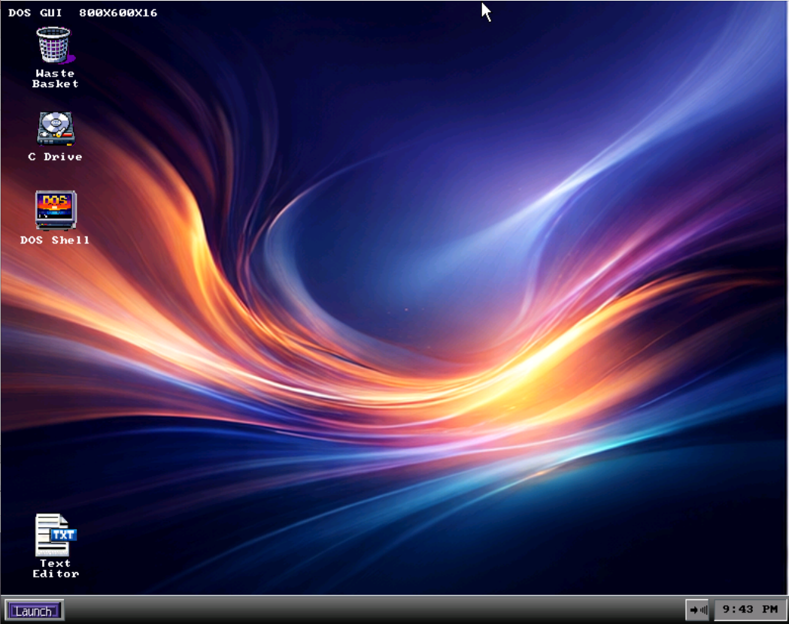
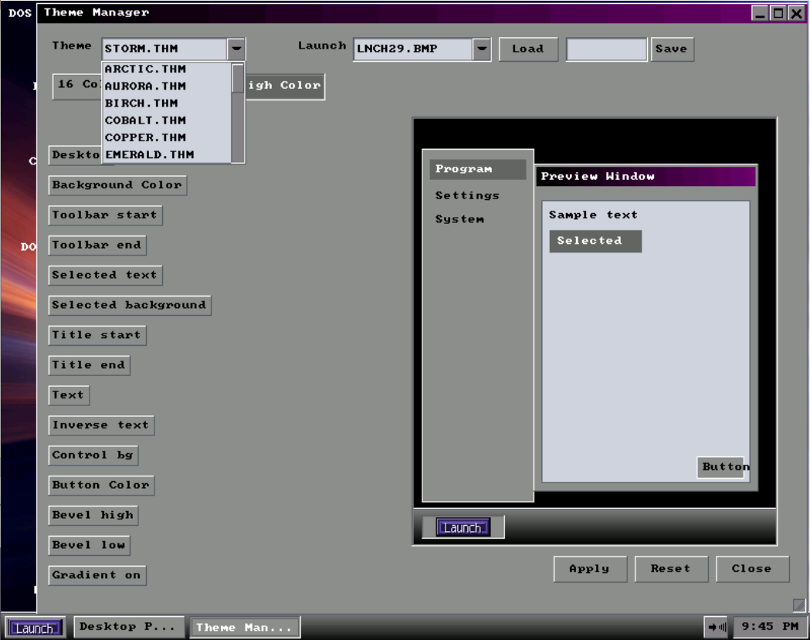
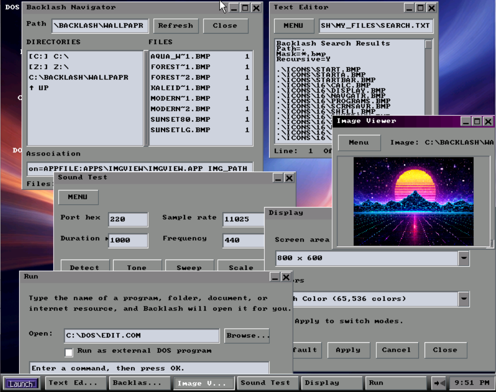

Backlash version 1.0.0
========

Backlash is a 32-bit protected-mode DOS graphical shell / operating environment written in FreeBASIC.
It provides windows, menus, desktop icons, launch shortcuts, file browsing, theming, wallpaper, sound settings, screensavers, and app-hosted tools.
Backlash apps are kept outside the shell where possible. Each app normally uses an .APP layout file, a .SYS action file, and optional helper EXE/source files.

Note
----

My original plan was to design a GUI that would run on a 386/DX or better. This project missed that mark by quite a bit. It will run  (albeit poorly) on a 486/66. Things start smoothing out on a 486/100.
I have not been able to test this outside of DOSBOX. If you run across any bugs, please send the behavior along with error messages. I don't have as much free time as I would like, but I will get to it when I can.
This is an active work in progress. Watch for updates.

Hope you enjoy!
-Rick  
 

SEE ALSO:

LICENSE.TXT - You know what this is
BACKPROG.TXT - Backlash app writing cheat sheet
KEYS.TXT - App-specific and programmable keyboard shortcuts

Included app areas
------------------

- Calculator (apps/calc/CALC.APP) - Provides basic/scientific calculator controls.
- Cleaner (apps/cleaner/CLEANER.APP) - Deletes temporary files and history.
- Desktop Properties (apps/DESKPROP/DESKPROP.app) - Configures desktop behavior and related display options.
- Display (apps/display.app) - Configures display settings.
- DOS Shell (apps/SHELL.APP) - Opens a DOS shell/command workflow.
- Hex / ASCII Viewer (apps/HEXVIEW/HEXVIEW.APP) - Shows files in offset, hex, and ASCII views.
- Icon Editor (apps/iconedit/ICONEDIT.APP) - Edits Backlash bitmap icons.
- Image Viewer (apps/imgview/IMGVIEW.APP) - Views images and slideshow content.
- Launch Menu Editor (system/menuedit/MENUEDIT.APP) - Edits launch menu entries.
- Run (apps/Run/RUN.APP) - Runs a command or app.
- Screensaver (apps/scrnsavr/SCRNSAVR.APP) - Configures screensavers.
- Search (apps/Search/SEARCH.APP) - Searches files and shows results.
- Sound Test (apps/sound/sndtest/SNDTEST.APP) - Tests sound output.
- System Info (apps/sysinfo/SYSINFO.APP) - Shows system, memory, disk, video, sound, and configuration details.
- Text Editor (apps/editor/TXTEDIT.APP) - Edits text files.
- Theme Manager (apps/Theme/THEME.APP) - Chooses and edits Backlash themes.
- UI Style (apps/UISTYLE/UISTYLE.APP) - Chooses button/window rendering style.
- Wallpaper (apps/wallpapr/WALLPAPR.APP) - Chooses and previews desktop wallpaper.
- Waste Basket (apps/recycle/RECYCLE.APP) - Shows and manages deleted items in the Waste Basket.
- Backlash Setup (BSETUP.EXE) - Command Line tool to set up Backlash
 
Design notes
------------
- All files written in FreeBASIC 1.10.1
- All graphics are owned by me. Any resemblance to other artwork is purely coincidental
  (How many different ways can you draw a CD icon anyway???) 
- App behavior is normally stored in app-owned .APP/.SYS/helper files.
- The shell provides generic window, drawing, desktop, taskbar, theme, file, and host services.
- App-specific behavior is kept out of shell/runtime files. 
- Keep filenames DOS 8.3 compatible unless a specific exception is approved.

DISCLAIMER
----------
Backlash is provided as-is. Use it at your own risk.
I am not responsible for data loss, system crashes, damaged files, damaged hardware, lost time, lost work, or any other problems caused by installing, running, modifying, or using Backlash.
Make backups before testing or changing anything.

- Rick Reedus
https://github.com/ReedusR/Backlash

Screenshots
-----------

Below are a few preview screenshots from the Backlash environment.

